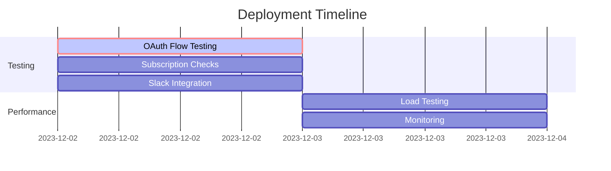

# Critical Path to Deployment Completion

## Current Blockers

### 1. Environment Configuration (COMPLETE)
- **Status**: ✅ Complete
- **Impact**: No longer blocking
- **Required Variables**:
  * ✅ GOOGLE_OAUTH_CLIENT_ID (Received)
  * ✅ GOOGLE_OAUTH_CLIENT_SECRET (Received)
  * ✅ JWT_SECRET (Generated)
  * ✅ FRONTEND_URL (miguelai.web.app)
  * ✅ GCP_PROJECT_ID (miguelai)
  * ✅ BIGQUERY_DATASET (Configured)
  * ✅ CORS_ORIGINS (Set to ["https://miguelai.web.app"])
  * ✅ NODE_ENV (production)
  * ✅ FUNCTION_REGION (us-central1)

### 2. OAuth Configuration (COMPLETE)
- **Status**: ✅ Complete
- **Impact**: Required for authentication flow
- **Dependencies**: None - all prerequisites met
- **Required Setup**:
  * ✅ JavaScript Origins configuration (Configured with https://miguelai.web.app)
  * ✅ Redirect URIs setup (Configured with function URLs)
  * ✅ Production URLs defined (miguelai.web.app)
  * ✅ Function URLs obtained

## Critical Path Sequence

1. **Environment Setup**
   ```mermaid
   graph TD
   A[Set Environment Variables] --> B[Configure OAuth Settings]
   B --> C[Deploy Cloud Functions]
   C --> D[Get Function URLs]
   D --> E[Update Frontend Config]
   E --> F[Deploy Frontend]
   ```

2. **Function Deployment**
   - ✅ Completed
   - Results:
     1. ✅ OAuth handler deployed
     2. ✅ Verification endpoint deployed
     3. ✅ Function URLs obtained:
        - handleGoogleAuth: https://us-central1-miguelai.cloudfunctions.net/handleGoogleAuth
        - verifySubscription: https://us-central1-miguelai.cloudfunctions.net/verifySubscription
     4. ✅ Update frontend configuration (Completed)

3. **Frontend Updates**
   - ✅ Complete
   - Status:
     1. ✅ Update environment with function URLs (Completed)
     2. ✅ Deploy to Firebase Hosting (Completed)
     3. ✅ Configure domain/SSL (Completed)
     4. ✅ Deploy with new environment (Completed)

4. **Integration Verification**
   - 🔄 Testing in Progress
   - Next Steps:
     1. ⏸️ Test OAuth flow (Ready to test at https://miguelai.web.app)
     2. 🔄 Verify subscription checks (Testing in progress - payment links activated)
     3. ⏸️ Test Slack integration (Ready to test notifications)

## Bottleneck Analysis

### Primary Bottleneck
Integration Testing is the current critical bottleneck:
- OAuth flow verification needed
- Subscription check verification required
- Slack integration testing pending

### Secondary Bottlenecks
1. Performance Optimization:
   - Load testing needed
   - Response time verification

## Resolution Path

1. **Immediate Actions**
   - Test OAuth flow end-to-end
   - Verify subscription checks
   - Test Slack integration

2. **Next Steps**
   - Load testing and performance verification
   - Monitor error rates and response times

3. **Final Steps**
   - Enable production monitoring
   - Document testing results

## Timeline Dependencies



## Risk Assessment

### High Risk
- Integration testing failures
- Performance under load

### Medium Risk
- Integration testing issues
- Performance bottlenecks

### Low Risk
- SSL/Domain configuration
- CDN setup
- Monitoring configuration

## Success Criteria

1. ✅ All environment variables set
2. ✅ Cloud Functions deployed
3. ✅ OAuth configuration complete
4. ✅ Frontend updated with function URLs
5. ⏸️ OAuth flow verified
6. 🔄 Subscription verification in testing
7. ❌ Slack integration tested
